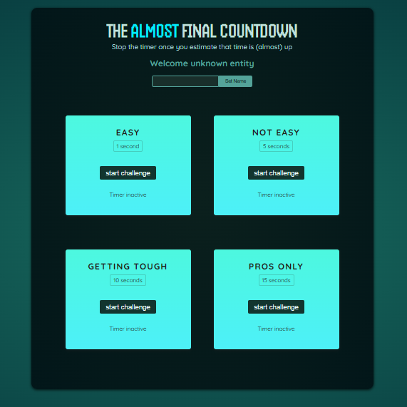
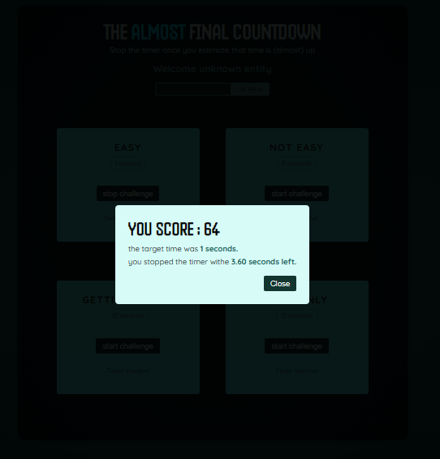
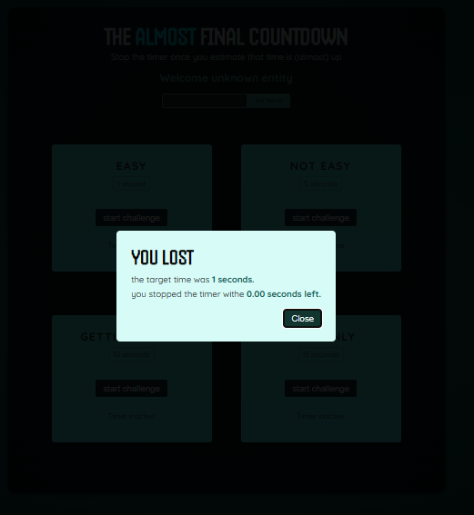

# The Almost Final Countdown

The Almost Final Countdown is a React application that allows users to start a countdown timer and stop it once they estimate that time is almost up. It's a simple tool to help users manage their time effectively for tasks or events.

## Features

- Countdown timer: Start a countdown timer with a specified duration.
- Stop the timer: Allow users to stop the timer once they estimate that time is almost up.
- User-friendly interface: Intuitive design for easy interaction.

## Technologies Used

- React: JavaScript library for building user interfaces.
- React Hooks: Utilized for managing state and side effects in functional components.
- CSS: Styling for the user interface.

## About the Developer

**Name:** Ben Hammouda Mohamed Ali  
**Role:** Full Stack Developer (React/.NET)

### Dashboard:

### Score Page :

### Lost page:

